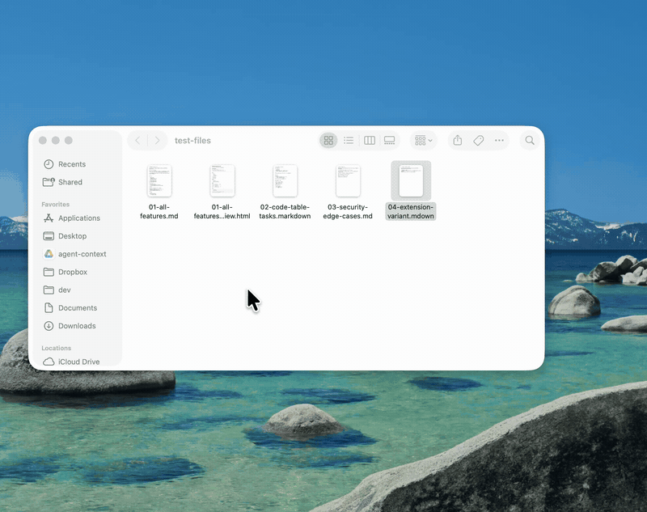

# Markdown QuickLook

[](https://devin.ai)

Markdown QuickLook is a macOS Quick Look extension that renders `.md` files when you press **spacebar** in Finder.

It supports headings, lists, task lists, inline formatting, code blocks, blockquotes, and native AppKit-rendered tables.



## Download

- **Landing page:** https://quicklookmd.com
- **Direct download:** [latest `MarkdownQuickLook.dmg`](https://github.com/jzone3/markdown-quicklook/releases/latest/download/MarkdownQuickLook.dmg)

Open the `.dmg`, drag **Markdown QuickLook** into `Applications`, and launch it once.
The app is not notarized yet, so on first open macOS may block it ("Apple could not
verify…"). To open it anyway, go to **System Settings → Privacy & Security**, scroll
to the message about Markdown QuickLook, and click **Open Anyway** — or run once:
`xattr -dr com.apple.quarantine /Applications/MarkdownQuickLook.app`.
(On macOS 15 Sequoia the old right-click → Open shortcut no longer works.)

## Recommended install (via an agent)

If you'd rather build from source, the easiest way is to ask **Devin** or another local coding agent to do it for you.

Quick Look extensions require a few Mac-specific steps that agents are good at handling:

- generating the Xcode project with XcodeGen
- building/signing the app and extension
- copying the app to `~/Applications`
- registering/enabling the Quick Look extension
- resetting Quick Look caches
- testing the preview with `qlmanage`

Give your agent this file:

```text
agent-instructions/INSTALL.md
```

Example prompt:

```text
Clone https://github.com/jzone3/markdown-quicklook and follow agent-instructions/INSTALL.md to install and test the Quick Look extension.
```

## Manual install

If you want to install manually:

```bash
git clone https://github.com/jzone3/markdown-quicklook.git
cd markdown-quicklook
brew install xcodegen
xcodegen generate
open MarkdownQuickLook.xcodeproj
```

Then in Xcode:

1. Select the `MarkdownQuickLook` target and set your signing Team.
2. Select the `QuickLookExtension` target and set the same signing Team.
3. Build and run the `MarkdownQuickLook` scheme once.
4. Open System Settings → General → Login Items & Extensions → Quick Look.
5. Enable **Markdown Preview**.
6. Select a `.md` file in Finder and press **spacebar**.

If the preview does not update:

```bash
qlmanage -r
qlmanage -r cache
```

## Features

- Native macOS Quick Look preview extension
- Menu bar helper app, no Dock icon
- Headings, paragraphs, blockquotes, lists, task lists, links, inline code, bold, italic, strikethrough
- Native AppKit table rendering with `NSTextTable`
- Sandboxed extension with no network access required
- Separate Swift package that can render Markdown to self-contained HTML
- `mdql` CLI for rendering Markdown files to HTML

## Development

Generate the Xcode project:

```bash
brew install xcodegen
xcodegen generate
```

Run package tests:

```bash
swift test
```

Render Markdown to HTML with the CLI:

```bash
swift run mdql Examples/sample.md preview.html
```

Build the app from Terminal if signing is already configured:

```bash
xcodebuild \
  -project MarkdownQuickLook.xcodeproj \
  -scheme MarkdownQuickLook \
  -configuration Debug \
  -derivedDataPath .derivedData-signed \
  build
```

## Landing page

The landing page (https://quicklookmd.com) is **not** part of this branch. Its
source is maintained separately on the [`gh-pages`](https://github.com/jzone3/markdown-quicklook/tree/gh-pages)
branch, which GitHub Pages serves directly. `master` is kept clean as the
buildable open-source project. See `AGENTS.md` for details.

## How it works

```text
Finder spacebar
  -> QuickLookExtension.appex
  -> PreviewViewController
  -> read Markdown file
  -> render native NSAttributedString
  -> display in NSTextView inside NSScrollView
```

The extension intentionally avoids `WKWebView` because WebKit helper processes can be fragile inside Quick Look extension sandboxes.

## Agent notes

Agents working in this repo should read `AGENTS.md` first.

Agents installing this for a user should follow `agent-instructions/INSTALL.md`.

## License

[MIT](LICENSE). Bundled assets and dependencies retain their own permissive licenses; see [`THIRD_PARTY_LICENSES.md`](THIRD_PARTY_LICENSES.md).
