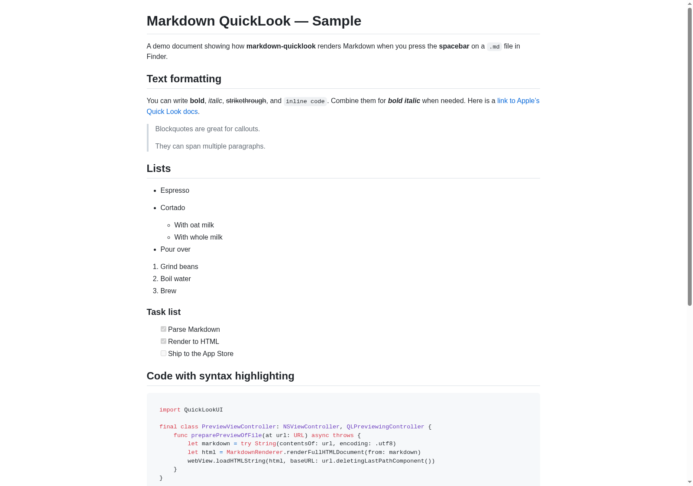
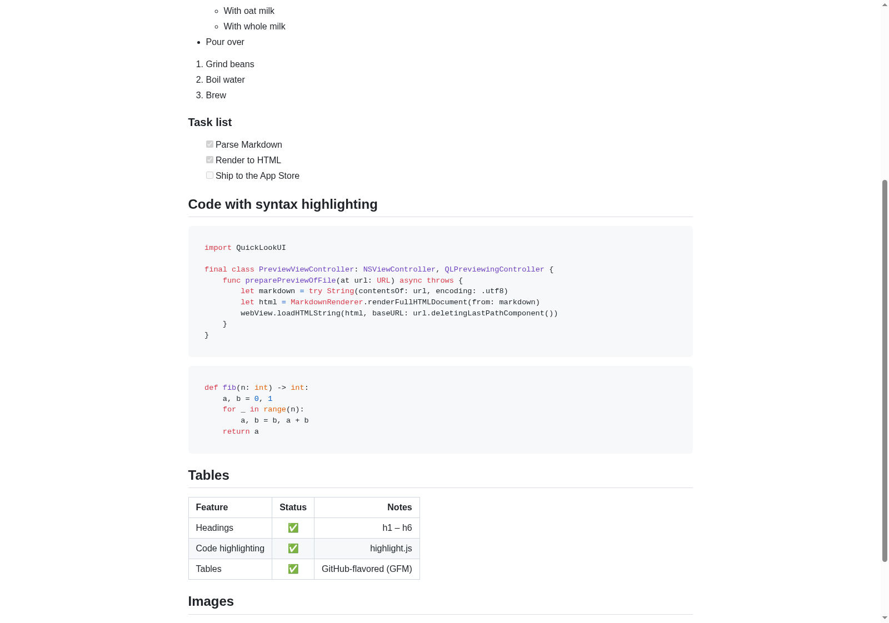

# Markdown QuickLook

Press the **spacebar** on a Markdown file in Finder and see it **rendered** —
headings, native tables, code blocks, task lists, the works — instead of raw
text.

macOS Quick Look shows `.md` files as plain text out of the box. **Markdown
QuickLook** is a small, open-source [Quick Look Preview Extension](https://developer.apple.com/documentation/quicklook/qlpreviewingcontroller)
that renders Markdown to a native AppKit preview right in the spacebar preview.




> [!IMPORTANT]
> **Branch note.** The installable app currently lives on the
> `devin/1780329911-markdown-quicklook` branch. The repository default branch is
> `master`, which still contains only the original stub README. If an agent is
> installing this from a fresh clone, make sure it checks out this branch first.

---

## Quick start (how to do it)

End-to-end, from a clean Mac to a rendered spacebar preview:

```bash
# 1. Get the code and check out the installable branch
git clone https://github.com/jzone3/markdown-quicklook.git
cd markdown-quicklook
git checkout devin/1780329911-markdown-quicklook

# 2. Generate the Xcode project (one-time tool install)
brew install xcodegen
xcodegen generate

# 3. Open it in Xcode
open MarkdownQuickLook.xcodeproj
```

4. In Xcode, set a **signing Team** on **both** targets (`MarkdownQuickLook` and
   `QuickLookExtension`): select each target → **Signing & Capabilities** → pick
   your Team (a free personal Apple ID is fine — choose *Sign to Run Locally* if
   you have no team).
5. Press **⌘R** to **Build & Run** the host app once. This registers the Markdown
   file type and the extension with macOS.
6. **Enable the extension:** System Settings → **General → Login Items &
   Extensions → Quick Look** → turn on **Markdown Preview**. (Path differs by
   macOS version — see [Enable the extension](#enable-the-extension). The app also
   has an *Open Extensions Settings* button.)
7. In Finder, select any `.md` file and press **spacebar** — you should see it
   rendered.

Stuck? Jump to [Troubleshooting](#troubleshooting). Want details on each step?
See [Build & install](#build--install) below.

---

## Features

- **GitHub-flavored Markdown** via Apple's [swift-markdown](https://github.com/swiftlang/swift-markdown)
  (cmark-gfm): headings, **bold**/*italic*/~~strike~~, inline & fenced code,
  ordered/unordered/nested lists, **task lists**, blockquotes, thematic breaks,
  links, images, and **GFM tables with column alignment**.
- **Native Quick Look preview:** the extension renders to AppKit `NSTextView`
  content, including real `NSTextTable` table cells, instead of relying on
  WebKit inside the Quick Look sandbox.
- **HTML renderer and CLI:** the shared `MarkdownRenderer` package can still
  render self-contained GitHub-styled HTML with [github-markdown-css](https://github.com/sindresorhus/github-markdown-css)
  and [highlight.js](https://github.com/highlightjs/highlight.js) via the `mdql`
  CLI or host app preview.
- **Sandbox-friendly:** the Quick Look extension does not require network access.
- **Security-first:** raw HTML in a `.md` file is escaped by default (no
  `<script>` injection); `javascript:` URLs are neutralized.
- **Shared, testable core:** the renderer is a UI-free Swift package that builds
  and is unit-tested on Linux and macOS. Includes a tiny `mdql` CLI.

---

## Requirements

- macOS 12 (Monterey) or later
- Xcode 14 or later
- [XcodeGen](https://github.com/yonaskolb/XcodeGen) (`brew install xcodegen`) to
  generate the Xcode project from `project.yml`

---

## Build & install

```bash
git clone https://github.com/jzone3/markdown-quicklook.git
cd markdown-quicklook
git checkout devin/1780329911-markdown-quicklook

# 1) Generate the Xcode project from the committed spec
brew install xcodegen        # if you don't have it
xcodegen generate

# 2) Open it
open MarkdownQuickLook.xcodeproj
```

In Xcode:

1. Select the **MarkdownQuickLook** scheme.
2. Open the **MarkdownQuickLook** target → **Signing & Capabilities** and set your
   **Team** (a free personal Apple ID works for local use; pick "Sign to Run
   Locally" if you have no team). Do the same for the **QuickLookExtension**
   target. The bundle identifiers default to `com.example.markdownquicklook(.QuickLookExtension)` —
   change the prefix to your own (e.g. `com.yourname.…`).
3. **Build & Run** (⌘R) once. Running the app registers the Markdown file type and
   the extension with the system.

> Prefer the command line? `xcodebuild -project MarkdownQuickLook.xcodeproj -scheme MarkdownQuickLook -configuration Release build`

### Agent-friendly install from Terminal

An agent with shell access on macOS can build, install, register, and enable the
extension without opening Xcode. This assumes Xcode command-line tools are
installed and a usable Apple Development signing certificate is available in the
login keychain. If signing fails, fall back to the Xcode instructions above and
set the Team manually on both targets.

```bash
git clone https://github.com/jzone3/markdown-quicklook.git
cd markdown-quicklook
git checkout devin/1780329911-markdown-quicklook

brew list xcodegen >/dev/null 2>&1 || brew install xcodegen
xcodegen generate

# Discover a local team ID from an Apple Development certificate.
TEAM_ID="$(
  security find-certificate -c 'Apple Development' -p \
    | openssl x509 -noout -subject \
    | sed -n 's/.* OU=\([^,]*\).*/\1/p' \
    | head -1
)"

xcodebuild \
  -project MarkdownQuickLook.xcodeproj \
  -scheme MarkdownQuickLook \
  -configuration Debug \
  -derivedDataPath .derivedData-signed \
  build \
  CODE_SIGN_STYLE=Manual \
  CODE_SIGN_IDENTITY='Apple Development' \
  DEVELOPMENT_TEAM="$TEAM_ID" \
  PROVISIONING_PROFILE_SPECIFIER=

mkdir -p "$HOME/Applications"
ditto .derivedData-signed/Build/Products/Debug/MarkdownQuickLook.app \
  "$HOME/Applications/MarkdownQuickLook.app"

open -gj "$HOME/Applications/MarkdownQuickLook.app"
sleep 2
pluginkit -e use -i com.example.markdownquicklook.QuickLookExtension || true
qlmanage -r
qlmanage -r cache
pluginkit -m -v | grep -i com.example.markdownquicklook
```

Then select a `.md` file in Finder and press **spacebar**. If the extension does
not appear, open System Settings → General → Login Items & Extensions → Quick
Look and enable **Markdown Preview** manually.

### Enable the extension

Quick Look extensions must be turned on once:

- **macOS 15 (Sequoia):** System Settings → **General → Login Items & Extensions**
  → **Quick Look** → enable **Markdown Preview**.
- **macOS 13–14 (Ventura/Sonoma):** System Settings → **Privacy & Security →
  Extensions → Quick Look** → enable **Markdown Preview**.
- **macOS 12 (Monterey):** System Preferences → **Extensions → Quick Look** →
  enable **Markdown Preview**.

The app has an **"Open Extensions Settings"** button to take you there.

### Try it

Select any `.md`/`.markdown` file in Finder and press **spacebar**.

If the preview doesn't update (Quick Look caches aggressively):

```bash
qlmanage -r            # reset Quick Look
qlmanage -r cache
# As a last resort, log out and back in.
```

You can also test a specific file from Terminal:

```bash
qlmanage -p path/to/file.md
```

---

## How it works

```
Finder (spacebar)
   └─▶ QuickLookExtension.appex  (NSExtensionPointIdentifier = com.apple.quicklook.preview)
          └─▶ PreviewViewController : QLPreviewingController
                 └─▶ read Markdown file as UTF-8 / Latin-1 fallback
                 └─▶ render native NSAttributedString
                        • headings, paragraphs, blockquotes, lists, task lists
                        • inline bold/italic/strike/code/links
                        • native NSTextTable / NSTextTableBlock tables
                 └─▶ NSTextView inside NSScrollView
```

The host app declares the `net.daringfireball.markdown` UTI (`App/Info.plist`) and
binds it to the common Markdown extensions, so Finder routes those files to the
extension. See [`RESEARCH.md`](RESEARCH.md) for the full design, the modern
Preview-Extension vs. legacy `.qlgenerator` comparison, the OSS projects studied,
and licensing.

### Repository layout

```
markdown-quicklook/
├── Package.swift                 # SwiftPM: MarkdownRenderer library + mdql CLI + tests
├── project.yml                   # XcodeGen spec → macOS app + Quick Look extension
├── Sources/
│   ├── MarkdownRenderer/         # UI-free Markdown→HTML core (Linux + macOS)
│   │   ├── MarkdownRenderer.swift
│   │   ├── HTMLMarkupVisitor.swift
│   │   ├── HTMLEscaping.swift
│   │   ├── BundledAsset.swift
│   │   └── Resources/            # github-markdown-css, highlight.js (+themes)
│   └── mdql/                     # tiny CLI that renders Markdown to HTML
├── Tests/MarkdownRendererTests/  # XCTest suite (runs on Linux)
├── App/                          # SwiftUI host app (sources, Info.plist, entitlements)
├── QuickLookExtension/           # QLPreviewingController, Info.plist, entitlements
├── Examples/sample.md            # demo document
├── docs/                         # screenshots
├── RESEARCH.md                   # research write-up
└── THIRD_PARTY_LICENSES.md
```

---

## Develop & test the rendering core (no Mac required)

The renderer is a normal Swift package; build and test it anywhere:

```bash
swift build
swift test

# Render a file to a self-contained HTML document with the CLI:
swift run mdql Examples/sample.md preview.html
# ...then open preview.html in any browser.
```

---

## Troubleshooting

**"Markdown Preview" doesn't appear in the Quick Look extensions list.**
Make sure you ran the host app at least once (⌘R) — registration only happens when
the app launches. Then re-open System Settings → Quick Look. If it still doesn't
show, run `pluginkit -m | grep -i markdown` in Terminal to confirm macOS sees the
extension.

**Spacebar still shows plain text (or an old version).**
Quick Look caches aggressively. Reset it:

```bash
qlmanage -r            # reload Quick Look generators
qlmanage -r cache      # clear the cache
# last resort: log out and back in
```

Test a specific file directly from Terminal:

```bash
qlmanage -p path/to/file.md
```

**`xcodegen: command not found`.** Install it with `brew install xcodegen` (or grab
a release from the [XcodeGen repo](https://github.com/yonaskolb/XcodeGen)).

**Signing / "failed to register bundle" errors.** Confirm you set a Team on *both*
the app and the extension targets, and that their bundle identifiers share a prefix
you own (e.g. `com.yourname.markdownquicklook` and
`com.yourname.markdownquicklook.QuickLookExtension`). Then clean (⇧⌘K) and rebuild.

**I just want to see what it renders without a Mac.** Use the CLI — see
[Develop & test the rendering core](#develop--test-the-rendering-core-no-mac-required).

---

## Contributing

Contributions welcome! Good first issues: a real app icon, a thumbnail extension
(`QLThumbnailProvider`), settings (raw-HTML passthrough, theme choice), Mermaid /
math support, and broader UTI coverage.

- Keep the **rendering core UI-free** so it stays Linux-testable; put any
  AppKit/WebKit code in the app/extension targets.
- Add/keep **unit tests** for renderer changes (`swift test`).
- Regenerate the project with `xcodegen generate` after editing `project.yml`
  (don't commit the generated `.xcodeproj`).
- Respect third-party licenses; don't copy GPL code (see
  [`THIRD_PARTY_LICENSES.md`](THIRD_PARTY_LICENSES.md)).

---

## License

[MIT](LICENSE). Bundled assets and dependencies retain their own permissive
licenses — see [`THIRD_PARTY_LICENSES.md`](THIRD_PARTY_LICENSES.md).
